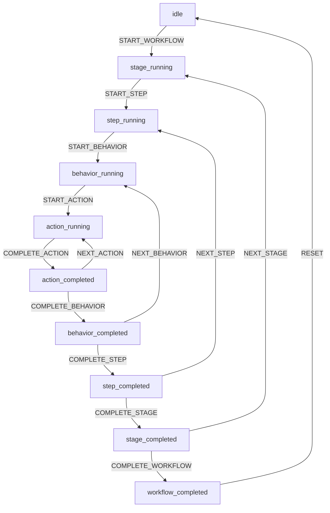
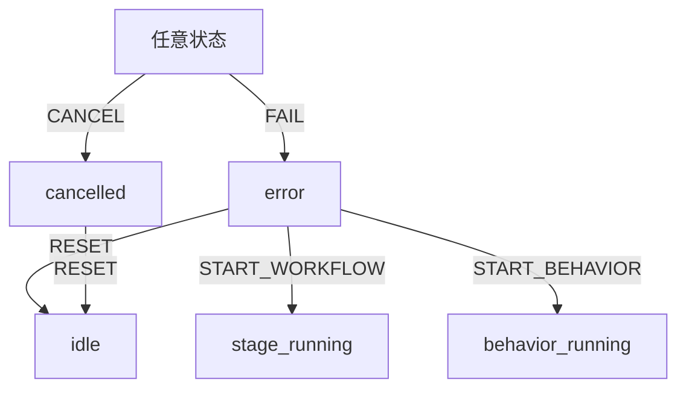
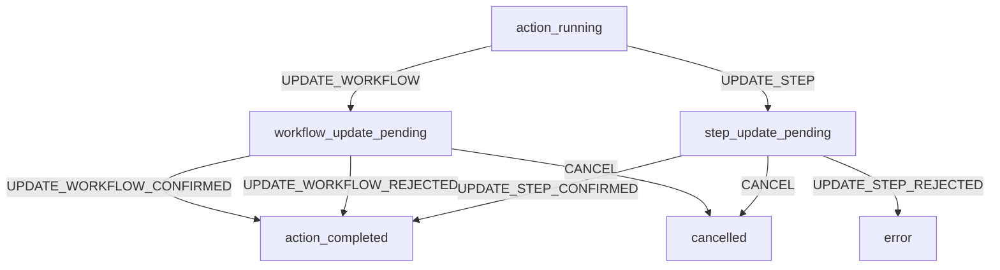

# 状态机协议规范

## 📋 概述

Notebook-BCC 采用基于 **有限状态机 (FSM)** 的工作流控制系统，与 POMDP 框架深度集成，实现分层工作流的执行和导航。

### 核心特性

- **层级化状态**: Workflow → Stage → Step → Behavior → Action
- **混合控制**: Planning API（目标判断）+ Client（导航控制）
- **容错机制**: 支持错误恢复和取消操作
- **动态更新**: 支持工作流和步骤的运行时更新

---

## 🏗️ 状态机架构

### 状态层级关系

```
Workflow (工作流)
    ├─ Stage 1 (阶段)
    │   ├─ Step 1 (步骤)
    │   │   ├─ Behavior 1 (行为)
    │   │   │   ├─ Action 1
    │   │   │   ├─ Action 2
    │   │   │   └─ Action N
    │   │   ├─ Behavior 2
    │   │   └─ Behavior N
    │   └─ Step N
    └─ Stage N
```

### 与 POMDP 的关系

| FSM 概念 | POMDP 概念 | 说明 |
|---------|-----------|------|
| **State** | Observation.location.current | 当前所处的工作流位置 |
| **Event** | Action (不同含义) | 触发状态转移的事件 |
| **Transition** | State Transition Function | 状态转移逻辑 |
| **Guard** | Planning API Response | 转移条件（targetAchieved） |

**关键区别**：
- FSM 的 "State" = POMDP 的 observation.location.current
- FSM 的 "Event" ≠ POMDP 的 Action（后者是内容生成动作）

---

## 🎯 状态定义

### 主要工作流状态

| 状态 | 说明 | 可观测信息 |
|------|------|-----------|
| **idle** | 初始状态，未开始任何工作流 | - |
| **stage_running** | 某个 Stage 正在执行 | stage_id |
| **step_running** | 某个 Step 正在执行 | stage_id, step_id |
| **behavior_running** | 某个 Behavior 正在执行 | stage_id, step_id, behavior_id, iteration |
| **action_running** | 某个 Action 正在执行 | 当前执行的 action |
| **action_completed** | Action 执行完成，等待下一步 | 已完成的 action |
| **behavior_completed** | Behavior 执行完成 | behavior_id, 产出结果 |
| **step_completed** | Step 执行完成 | step_id, 产出结果 |
| **stage_completed** | Stage 执行完成 | stage_id, 产出结果 |
| **workflow_completed** | 整个工作流完成 | 最终产出 |

### 特殊状态

| 状态 | 说明 | 恢复方式 |
|------|------|---------|
| **error** | 执行出错，需要处理 | RESET → idle, 或容错重启 |
| **cancelled** | 用户取消执行 | RESET → idle |
| **workflow_update_pending** | 等待工作流更新确认 | CONFIRM 或 REJECT |
| **step_update_pending** | 等待步骤更新确认 | CONFIRM 或 REJECT |

---

## ⚡ 事件定义

### Planning API 触发的事件

Planning API 通过 `targetAchieved` 和 `transition` 字段触发以下事件：

| 事件 | 触发条件 | Planning API 响应 |
|------|---------|------------------|
| **START_BEHAVIOR** | Step 目标未达成 | `targetAchieved: false` |
| **COMPLETE_BEHAVIOR** | Behavior 完成反馈后 | `transition.continue_behaviors: false` |
| **NEXT_BEHAVIOR** | 需要更多 Behavior | `transition.continue_behaviors: true` |
| **COMPLETE_STEP** | Step 目标达成 | `targetAchieved: true` |
| **COMPLETE_STAGE** | Stage 所有步骤完成 | `targetAchieved: true` |
| **COMPLETE_WORKFLOW** | 所有 Stage 完成 | `targetAchieved: true` |
| **UPDATE_WORKFLOW** | 需要更新工作流 | `context_update.workflow_update` |
| **UPDATE_STEP** | 需要更新步骤列表 | `context_update.stage_steps_update` |

### Client 触发的事件

Client 根据用户操作或逻辑判断触发以下事件：

| 事件 | 触发时机 | Client 逻辑 |
|------|---------|------------|
| **START_WORKFLOW** | 用户开始工作流 | 导航到第一个 Stage |
| **START_STEP** | 进入新的 Step | 导航到 Step |
| **START_ACTION** | Generating API 返回 Actions | 开始执行 Action 队列 |
| **COMPLETE_ACTION** | Action 执行器完成一个 Action | 标记 Action 完成 |
| **NEXT_ACTION** | 队列中还有 Action | 继续执行下一个 |
| **NEXT_STEP** | Step 完成，还有剩余 Steps | 导航到下一个 Step |
| **NEXT_STAGE** | Stage 完成，还有剩余 Stages | 导航到下一个 Stage |
| **FAIL** | 执行出错 | 错误处理 |
| **CANCEL** | 用户取消 | 终止执行 |
| **RESET** | 重置状态机 | 回到 idle |
| **UPDATE_WORKFLOW_CONFIRMED** | 用户确认工作流更新 | 应用更新 |
| **UPDATE_WORKFLOW_REJECTED** | 用户拒绝工作流更新 | 拒绝更新 |
| **UPDATE_STEP_CONFIRMED** | 用户确认步骤更新 | 应用更新 |
| **UPDATE_STEP_REJECTED** | 用户拒绝步骤更新 | 拒绝更新 |

### Generating API 触发的事件

| 事件 | 触发时机 | Generating API 响应 |
|------|---------|-------------------|
| **START_ACTION** | 返回 Actions 列表 | 流式或批量返回 actions |

---

## 🔄 完整状态转移表

### 核心工作流转移

| 当前状态 | 事件 | 下一状态 | 负责方 | API 调用 |
|---------|------|---------|--------|---------|
| **idle** | START_WORKFLOW | stage_running | Planning | /planning |
| **stage_running** | START_STEP | step_running | Planning | /planning |
| **stage_running** | COMPLETE_STAGE | stage_completed | Planning | /planning |
| **step_running** | START_BEHAVIOR | behavior_running | Planning | /planning |
| **step_running** | COMPLETE_STEP | step_completed | Planning | /planning |
| **behavior_running** | START_ACTION | action_running | Generating | /generating |
| **behavior_running** | COMPLETE_BEHAVIOR | behavior_completed | Planning | /planning |
| **action_running** | COMPLETE_ACTION | action_completed | Client | — |
| **action_completed** | NEXT_ACTION | action_running | Client | — |
| **action_completed** | COMPLETE_BEHAVIOR | behavior_completed | Planning | /planning |
| **behavior_completed** | NEXT_BEHAVIOR | behavior_running | Planning | /planning |
| **behavior_completed** | COMPLETE_STEP | step_completed | Planning | /planning |
| **step_completed** | NEXT_STEP | step_running | Client | — |
| **step_completed** | COMPLETE_STAGE | stage_completed | Planning | /planning |
| **stage_completed** | NEXT_STAGE | stage_running | Client | — |
| **stage_completed** | COMPLETE_WORKFLOW | workflow_completed | Planning | /planning |
| **workflow_completed** | RESET | idle | Client | — |

### 动态更新转移

| 当前状态 | 事件 | 下一状态 | 负责方 | 说明 |
|---------|------|---------|--------|------|
| **action_running** | UPDATE_WORKFLOW | workflow_update_pending | Planning | Planning 提议工作流更新 |
| **action_running** | UPDATE_STEP | step_update_pending | Planning | Planning 提议步骤更新 |
| **workflow_update_pending** | UPDATE_WORKFLOW_CONFIRMED | action_completed | Client | 用户确认更新 |
| **workflow_update_pending** | UPDATE_WORKFLOW_REJECTED | action_completed | Client | 用户拒绝更新 |
| **workflow_update_pending** | COMPLETE_ACTION | workflow_update_pending | Client | 占位符，保持挂起 |
| **step_update_pending** | UPDATE_STEP_CONFIRMED | action_completed | Client | 用户确认更新 |
| **step_update_pending** | UPDATE_STEP_REJECTED | error | Client | 用户拒绝更新 |

### 错误和取消转移

| 当前状态 | 事件 | 下一状态 | 负责方 | 说明 |
|---------|------|---------|--------|------|
| **stage_running** | FAIL | error | Client | Stage 执行失败 |
| **stage_running** | CANCEL | cancelled | Client | 用户取消 Stage |
| **step_running** | FAIL | error | Client | Step 执行失败 |
| **step_running** | CANCEL | cancelled | Client | 用户取消 Step |
| **behavior_running** | FAIL | error | Client | Behavior 执行失败 |
| **behavior_running** | CANCEL | cancelled | Client | 用户取消 Behavior |
| **action_running** | FAIL | error | Client | Action 执行失败 |
| **action_running** | CANCEL | cancelled | Client | 用户取消 Action |
| **action_completed** | FAIL | error | Client | 验证失败 |
| **action_completed** | CANCEL | cancelled | Client | 用户取消 |
| **behavior_completed** | FAIL | error | Client | Behavior 完成后验证失败 |
| **behavior_completed** | CANCEL | cancelled | Client | 用户取消 |
| **step_completed** | FAIL | error | Client | Step 完成后验证失败 |
| **step_completed** | CANCEL | cancelled | Client | 用户取消 |
| **stage_completed** | CANCEL | cancelled | Client | 用户取消 |
| **workflow_update_pending** | CANCEL | cancelled | Client | 用户取消更新 |
| **step_update_pending** | CANCEL | cancelled | Client | 用户取消更新 |

### 恢复转移

| 当前状态 | 事件 | 下一状态 | 负责方 | 说明 |
|---------|------|---------|--------|------|
| **error** | RESET | idle | Client | 重置状态机 |
| **error** | START_WORKFLOW | stage_running | Client | 容错重启整个工作流 |
| **error** | START_BEHAVIOR | behavior_running | Client | 容错重启 Behavior |
| **cancelled** | RESET | idle | Client | 重置状态机 |

---

## 🎨 状态转移流程图

### 正常工作流



### 错误处理流程



### 动态更新流程



---

## 📝 责任划分

### Planning API 的职责

Planning API 负责**目标判断和策略决策**：

**触发的转移**：
1. **START_BEHAVIOR** - 判断 Step 目标未达成，需要生成 Behavior
2. **COMPLETE_BEHAVIOR** - Behavior 反馈后，判断是否继续
3. **NEXT_BEHAVIOR** - 决定需要更多 Behavior
4. **COMPLETE_STEP** - 判断 Step 目标已达成
5. **COMPLETE_STAGE** - 判断 Stage 完成
6. **COMPLETE_WORKFLOW** - 判断整个工作流完成
7. **UPDATE_WORKFLOW** - 提议工作流结构更新
8. **UPDATE_STEP** - 提议步骤列表更新

**判断依据**：
- `observation.context.variables` - 环境变量
- `observation.context.effects` - 代码执行输出
- `observation.location.progress` - 进度和产出追踪
- `observation.location.goals` - 目标定义

**响应格式**：
```json
{
  "targetAchieved": true/false,
  "transition": {
    "continue_behaviors": true/false,
    "target_achieved": true/false
  },
  "context_update": {
    "workflow_update": {...},
    "stage_steps_update": {...}
  }
}
```

### Client 的职责

Client 负责**导航控制和执行管理**：

**触发的转移**：
1. **START_WORKFLOW** - 初始化工作流
2. **START_STEP** - 进入新 Step
3. **START_ACTION** - 开始执行 Action
4. **COMPLETE_ACTION** - 标记 Action 完成
5. **NEXT_ACTION** - 继续执行队列中的下一个 Action
6. **NEXT_STEP** - 导航到下一个 Step
7. **NEXT_STAGE** - 导航到下一个 Stage
8. **FAIL** - 错误处理
9. **CANCEL** - 取消执行
10. **RESET** - 重置状态机
11. **UPDATE_*_CONFIRMED/REJECTED** - 处理更新确认

**决策依据**：
- Planning API 的 `targetAchieved` 信号
- `workflow_template` 结构（剩余 stages/steps）
- Action 队列状态
- 用户输入（确认/取消）
- 错误状态

### Generating API 的职责

Generating API 负责**内容生成**：

**触发的转移**：
1. **START_ACTION** - 返回 Actions 列表后，Client 进入 action_running

**响应格式**：
```json
// 流式
{"action": {"action": "add", "content": "...", "shot_type": "dialogue"}}
{"action": {"action": "exec", "codecell_id": "...", "shot_type": "action"}}

// 非流式
{
  "actions": [
    {"action": "add", "content": "...", "shot_type": "dialogue"},
    {"action": "exec", "codecell_id": "...", "shot_type": "action"}
  ]
}
```

---

## 🔍 典型场景示例

### 场景 1: 正常 Step 执行

```
1. [step_running] Client 调用 Planning API
   └─ Planning 返回 targetAchieved: false
   └─ 触发 START_BEHAVIOR → [behavior_running]

2. [behavior_running] Client 调用 Generating API
   └─ Generating 返回 actions 列表
   └─ 触发 START_ACTION → [action_running]

3. [action_running] Client 执行第一个 Action
   └─ Action 执行完成
   └─ 触发 COMPLETE_ACTION → [action_completed]

4. [action_completed] Client 检查队列
   └─ 还有更多 Actions
   └─ 触发 NEXT_ACTION → [action_running]
   └─ 重复步骤 3

5. [action_completed] 所有 Actions 执行完成
   └─ Client 调用 Planning API (feedback)
   └─ Planning 返回 transition.continue_behaviors: false, targetAchieved: true
   └─ 触发 COMPLETE_STEP → [step_completed]

6. [step_completed] Client 导航
   └─ 还有剩余 Steps
   └─ 触发 NEXT_STEP → [step_running]
```

### 场景 2: Behavior 迭代

```
1. [behavior_completed] Client 调用 Planning API (feedback)
   └─ Planning 返回 transition.continue_behaviors: true
   └─ 触发 NEXT_BEHAVIOR → [behavior_running]

2. [behavior_running] behavior_iteration += 1
   └─ 重复 Generating → Actions → 执行流程
```

### 场景 3: 动态工作流更新

```
1. [action_running] 执行 Action 时，Planning API 建议更新
   └─ Planning 在之前的响应中包含 context_update.workflow_update
   └─ 触发 UPDATE_WORKFLOW → [workflow_update_pending]

2. [workflow_update_pending] Client 暂停执行，提示用户
   └─ 用户确认: 触发 UPDATE_WORKFLOW_CONFIRMED → [action_completed]
   └─ 用户拒绝: 触发 UPDATE_WORKFLOW_REJECTED → [action_completed]

3. [action_completed] 继续正常流程
```

### 场景 4: 错误恢复

```
1. [action_running] Action 执行失败
   └─ 触发 FAIL → [error]

2. [error] Client 显示错误信息
   └─ 选项 1: RESET → [idle] (重置)
   └─ 选项 2: START_WORKFLOW → [stage_running] (重启工作流)
   └─ 选项 3: START_BEHAVIOR → [behavior_running] (重启 Behavior)
```

---

## ⚙️ 实现指南

### Client 端状态机实现

**核心接口**：

```python
class StateMachine:
    """工作流状态机"""

    def __init__(self):
        self._state: str = "idle"
        self._stage_id: Optional[str] = None
        self._step_id: Optional[str] = None
        self._behavior_id: Optional[str] = None
        self._behavior_iteration: int = 0

    # 状态查询
    def get_state(self) -> str:
        """获取当前状态"""
        return self._state

    def is_running(self) -> bool:
        """是否正在执行"""
        return self._state not in ["idle", "error", "cancelled", "workflow_completed"]

    # 状态转移
    def transition(self, event: str) -> bool:
        """
        执行状态转移

        Args:
            event: 事件名称（如 "START_WORKFLOW"）

        Returns:
            转移是否成功
        """
        next_state = self._get_next_state(self._state, event)
        if next_state is None:
            logger.warning(f"Invalid transition: {self._state} --{event}--> ?")
            return False

        self._state = next_state
        logger.info(f"State transition: {self._state} --{event}--> {next_state}")
        return True

    def _get_next_state(self, current: str, event: str) -> Optional[str]:
        """根据转移表查找下一个状态"""
        # 实现转移表查找逻辑
        pass
```

**事件处理示例**：

```python
# 场景：Step 开始
response = planning_api.check_step_goal(observation)

if response['targetAchieved']:
    # 目标已达成，直接完成 Step
    state_machine.transition('COMPLETE_STEP')
else:
    # 需要生成 Behavior
    state_machine.transition('START_BEHAVIOR')

    # 获取 Actions
    actions = generating_api.get_actions(observation)
    state_machine.transition('START_ACTION')

    # 执行 Actions
    for action in actions:
        script_store.exec_action(action)
        state_machine.transition('COMPLETE_ACTION')

        if not is_last_action:
            state_machine.transition('NEXT_ACTION')

    # Behavior 完成，发送反馈
    feedback_response = planning_api.send_feedback(observation, behavior_feedback)

    if feedback_response['transition']['continue_behaviors']:
        state_machine.transition('NEXT_BEHAVIOR')
    elif feedback_response['targetAchieved']:
        state_machine.transition('COMPLETE_STEP')
```

### Planning API 实现

**返回格式**：

```python
def check_goal(observation: Dict) -> Dict:
    """检查目标是否达成"""

    # 分析当前状态
    current_level = observation['location']['current']
    progress = observation['location']['progress']
    context = observation['context']

    # 判断目标达成
    target_achieved = analyze_goal_achievement(context, progress)

    return {
        'targetAchieved': target_achieved,
        'transition': {
            'continue_behaviors': not target_achieved,
            'target_achieved': target_achieved
        },
        'context_update': {
            'variables': {...},
            'progress_update': {
                'level': 'behaviors',
                'focus': '【详细分析文本】...'
            }
        }
    }
```

---

## 🛡️ 错误处理和容错

### 错误类型

| 错误类型 | 触发条件 | 处理方式 |
|---------|---------|---------|
| **API 调用失败** | Planning/Generating API 不可达 | 重试，降级到默认策略 |
| **Action 执行失败** | 代码执行错误 | 记录到 effects，继续或中止 |
| **状态不一致** | Client 和 Server 状态不同步 | 重新同步，或重置状态机 |
| **用户中断** | 用户取消操作 | 清理资源，转到 cancelled |

### 容错策略

**1. 重试机制**：
```python
def call_planning_api_with_retry(observation: Dict, max_retries: int = 3) -> Dict:
    """带重试的 Planning API 调用"""
    for attempt in range(max_retries):
        try:
            return planning_api.call(observation)
        except APIError as e:
            if attempt == max_retries - 1:
                # 最后一次尝试失败，降级
                return fallback_planning_response()
            time.sleep(2 ** attempt)  # 指数退避
```

**2. 降级策略**：
```python
def fallback_planning_response() -> Dict:
    """Planning API 失败时的降级响应"""
    return {
        'targetAchieved': False,  # 默认未达成，继续执行
        'transition': {
            'continue_behaviors': False,  # 不继续，避免无限循环
            'target_achieved': False
        }
    }
```

**3. 状态恢复**：
```python
def recover_from_error(state_machine: StateMachine, error: Exception):
    """从错误中恢复"""
    if isinstance(error, RecoverableError):
        # 可恢复错误：重启 Behavior
        state_machine.transition('START_BEHAVIOR')
    else:
        # 不可恢复错误：重置状态机
        state_machine.transition('RESET')
```

---

## 🔗 与其他协议的关系

### 与 OBSERVATION_PROTOCOL.md 的关系

**状态机提供**：
- `observation.location.current` - 当前状态对应的位置信息
  ```json
  {
    "stage_id": "data_cleaning",
    "step_id": "handle_missing_values",
    "behavior_id": "behavior_003",
    "behavior_iteration": 3
  }
  ```

**状态机使用**：
- `observation.location.progress` - 判断导航决策（是否有剩余 steps/stages）
- `observation.context` - 作为 Planning API 的输入

### 与 API_PROTOCOL.md 的关系

**Planning API 触发状态转移**：
- `targetAchieved: true` → COMPLETE_STEP / COMPLETE_STAGE
- `transition.continue_behaviors: true` → NEXT_BEHAVIOR
- `context_update.workflow_update` → UPDATE_WORKFLOW

**Client 根据状态调用 API**：
- `step_running` 状态 → 调用 Planning API
- `behavior_running` 状态 → 调用 Generating API
- `behavior_completed` 状态 → 调用 Planning API (feedback)

### 与 ACTION_PROTOCOL.md 的关系

**状态机控制 Action 执行**：
- `action_running` 状态：执行单个 Action
- `action_completed` → `NEXT_ACTION` → `action_running`：执行队列中的下一个
- Action 执行失败 → `FAIL` → `error`

---

## 📊 状态机监控和调试

### 状态追踪

**记录在 observation.context.FSM**：

```json
{
  "FSM": {
    "state": "behavior_running",
    "last_transition": "START_BEHAVIOR -> behavior_running",
    "timestamp": "2025-10-30T10:23:45Z",
    "history": [
      {"from": "idle", "event": "START_WORKFLOW", "to": "stage_running", "timestamp": "..."},
      {"from": "stage_running", "event": "START_STEP", "to": "step_running", "timestamp": "..."},
      {"from": "step_running", "event": "START_BEHAVIOR", "to": "behavior_running", "timestamp": "..."}
    ]
  }
}
```

### 调试工具

**状态机可视化**：
```python
def visualize_state_machine(state_machine: StateMachine):
    """可视化当前状态机"""
    print(f"Current State: {state_machine.get_state()}")
    print(f"Stage: {state_machine.stage_id}")
    print(f"Step: {state_machine.step_id}")
    print(f"Behavior: {state_machine.behavior_id} (iteration {state_machine.behavior_iteration})")
```

**转移历史查询**：
```python
def get_transition_history(observation: Dict) -> List[Dict]:
    """获取状态转移历史"""
    return observation['context']['FSM']['history']
```

---

## ✅ 最佳实践

### 1. Planning First 原则

每个 Step 开始前，**必须先调用 Planning API**：

```python
# ✅ 正确
response = planning_api.check_step_goal(observation)
if response['targetAchieved']:
    state_machine.transition('COMPLETE_STEP')
else:
    state_machine.transition('START_BEHAVIOR')
    actions = generating_api.get_actions(observation)

# ❌ 错误：直接调用 Generating API
actions = generating_api.get_actions(observation)  # 跳过了 Planning
```

### 2. 状态转移的原子性

状态转移应该是原子的，不可中断：

```python
# ✅ 正确
def complete_behavior(state_machine, planning_api, observation):
    feedback_response = planning_api.send_feedback(observation, behavior_feedback)

    # 原子转移
    if feedback_response['transition']['continue_behaviors']:
        state_machine.transition('NEXT_BEHAVIOR')
    elif feedback_response['targetAchieved']:
        state_machine.transition('COMPLETE_STEP')

# ❌ 错误：中间有异步操作
def complete_behavior(state_machine, planning_api, observation):
    feedback_response = planning_api.send_feedback(observation, behavior_feedback)
    await asyncio.sleep(1)  # ❌ 可能导致状态不一致
    state_machine.transition('NEXT_BEHAVIOR')
```

### 3. 错误时清理资源

转移到 error 或 cancelled 状态时，清理资源：

```python
def handle_error(state_machine, error):
    # 清理资源
    cleanup_actions()
    cleanup_temporary_variables()

    # 转移状态
    state_machine.transition('FAIL')

    # 记录错误
    log_error(error)
```

### 4. 记录详细的转移日志

每次状态转移都应该记录：

```python
def transition(self, event: str) -> bool:
    old_state = self._state
    new_state = self._get_next_state(old_state, event)

    if new_state is None:
        logger.warning(f"❌ Invalid transition: {old_state} --{event}--> ?")
        return False

    self._state = new_state

    # 记录到 FSM history
    self._fsm_history.append({
        'from': old_state,
        'event': event,
        'to': new_state,
        'timestamp': datetime.now().isoformat()
    })

    logger.info(f"✅ State transition: {old_state} --{event}--> {new_state}")
    return True
```

---

## 🔗 相关文档

- [OBSERVATION_PROTOCOL.md](./OBSERVATION_PROTOCOL.md) - Observation 结构和产出追踪
- [API_PROTOCOL.md](./API_PROTOCOL.md) - Planning 和 Generating API 协议
- [ACTION_PROTOCOL.md](./ACTION_PROTOCOL.md) - Action 类型和格式
- [REFACTORING_SUMMARY.md](./REFACTORING_SUMMARY.md) - 系统重构总结
- [README.md](./README.md) - 文档导航

---

**Last Updated**: 2025-10-30
**Version**: 2.0
